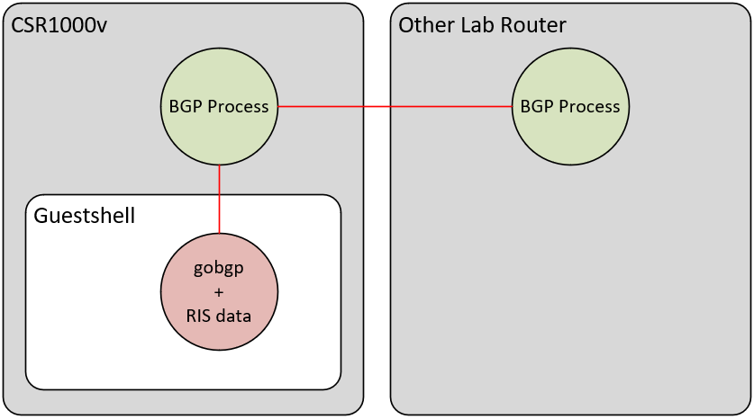

# run-dfz

<p align="center">
  
</p>

One of the things I have wanted to test over the years was having realistic Internet BGP data inside of a lab network. Traditionally this would entail peering with a real router in production. I have never been in an environment that would be OK with this, so I always just simulated the Internet with a couple of prefixes. This fixes that problem and allows you to run a router and get hundreds of thousands of BGP prefixes into your lab environment.


# Architecture

This works by running a guestshell instance on a CSR1000v router and then peering from the guestshell to the host router itself. The guestshell is injecting the prefixes in, and then you have a "real router" to then peer elsewhere in your lab network.



# Installation

1. Provision a CSR1000v in your lab emulation software with a fair amount of memory (I tested with 16GB, but you may be able to get away with less). I was only able to get the guestshell to run with a maximum of 4GB with the `app-hosting` configuration, so that may be the limiting factor even if the CSR1000v can have more memory. That said, inside of guestshell, it does show 16GB of memory available, but I have a feeling the LXC container management will enforce 4 GB limit. I think this is the case because when trying to do some compilation and other things, the CSR1000v kernel was logging to console that it was rate-limiting the container. Below is the memory utilization when running with 174k prefixes. Not too bad!
    ```
    Router#show platform software status control-processor brief
    Load Average
    Slot  Status  1-Min  5-Min 15-Min
    RP0 Healthy   3.00   2.92   2.95\

    Memory (kB)
    Slot  Status    Total     Used (Pct)     Free (Pct) Committed (Pct)
    RP0 Healthy 16370252  3485160 (21%) 12885092 (79%)   4656900 (28%)
    ```

2. Connect the router to the outside world via a cloud/NAT/bridged connection. You will need to pull the necessary files onto the router.

    

3. Provision the router with guestshell and the necessary bits to allow front-panel port connectivity (and Internet access) to guestshell.
    ```
    conf t
    interface VirtualPortGroup0
     description *** SVI facing guestshell container ***
     ip nat inside
     ip address 192.168.100.1 255.255.255.0
     no shut
    !
    interface GigabitEthernet1
     description *** Outside Network Connectivity ***
     ip nat outside
     ip address 192.168.4.96 255.255.255.0
     no shut
    !
    ip route 0.0.0.0 0.0.0.0 192.168.4.1
    !
    access-list 1 permit 192.168.100.0 0.0.0.255
    !
    ip nat inside source list 1 interface GigabitEthernet1 overload
    !
    app-hosting appid guestshell
     resource profile custom cpu 20000 memory 4096
    !
    iox
    !
    end
    !
    guestshell enable virtualPortGroup 0 guest-ip 192.168.100.2 name-server 8.8.8.8
    !
    ```
4. Enter the guestshell.

    `guestshell`

5. Install tmux and git and upgrade a couple packages.

    `sudo yum install tmux git -y`

    `sudo yum update -y nss curl libcurl`

6. Install Go using [these instructions](https://linuxize.com/post/how-to-install-go-on-centos-7/).

7. Change directory into the /bootflash directory and download GoBGP.

    `cd /bootflash && wget https://github.com/osrg/gobgp/releases/download/v2.10.0/gobgp_2.10.0_linux_amd64.tar.gz`

8. Extract the tar.gz file.

    `sudo tar zxvf gobgp_2.10.0_linux_amd64.tar.gz --wildcards -C /usr/sbin 'gobgp*'`

9. Clone this git repo inside of your guestshell and enter the directory.

    `git clone https://github.com/clay584/run-dfz.git /bootflash/run-dfz && cd /bootflash/run-dfz`

10. Download any of the route data files from RIPE.

    `https://www.ripe.net/analyse/internet-measurements/routing-information-service-ris/ris-raw-data`

11. Extract the routing data.

    `gunzip -d latest-bviews.gz`

12. Enter a tmux shell.

    `tmux`

13. Run gobgpd and point to `gobgpd.conf`.

    `sudo -E ./gobgpd -f gobgpd.conf`

14. Exit the guestshell

    `ctrl + b` then press `d` to disconnect from the tmux session.

15. Inject the routes with the gobgp client cli tool where the last parameter (100000) is the number of prefixes to inject. You can go as high as you want, but if you run this inside of guestshell, the resources are so constrained that it is likely it will crash gobgp. 100k routes is a good number. If you want all 800k, then it is much more stable to run this gobgp part from a regular linux server that has engough CPU and memory to do the whole table.

    `gobgp mrt --no-ipv6 --nexthop 192.168.100.2 inject global latest-bview 100000`

16. Configure BGP on the router.
    ```
    conf t
    router bgp 65000
    bgp log-neighbor-changes
    no bgp default ipv4-unicast
    neighbor 192.168.100.2 remote-as 64999
    !
    address-family ipv4
    neighbor 192.168.100.2 activate
    exit-address-family
    !
    end
    ```
17. The BGP peering should come up and you should get a lot of routes in the RIB.

    ```
    Router#sh ip bgp sum
    BGP router identifier 192.168.4.97, local AS number 65000
    BGP table version is 6345703, main routing table version 6345703
    807176 network entries using 200179648 bytes of memory
    807176 path entries using 109775936 bytes of memory
    120947/120947 BGP path/bestpath attribute entries using 33865160 bytes of memory
    106349 BGP AS-PATH entries using 5628320 bytes of memory
    1 BGP ATTR_SET entries using 40 bytes of memory
    292 BGP community entries using 17064 bytes of memory
    13 BGP extended community entries using 432 bytes of memory
    0 BGP route-map cache entries using 0 bytes of memory
    0 BGP filter-list cache entries using 0 bytes of memory
    BGP using 349466560 total bytes of memory
    BGP activity 807176/0 prefixes, 807176/0 paths, scan interval 60 secs

    Neighbor        V           AS MsgRcvd MsgSent   TblVer  InQ OutQ Up/Down  State/PfxRcd
    192.168.4.72    4        64999 6345738      41  6345703    0    0 00:17:08   807176
    ```

18. Once you have this working, it is ok to disconnect the router from the real network. It is no longer needed after installation.
